# Foo

## Install Chef Development Kit

The first step to managing a node remotely is to install the Chef Development Kit (ChefDK) on your workstation. 

Please go [here](https://downloads.chef.io/chef-dk/) and download the version appropriate for your laptop.

## Provision a Resource

While Chef or any of the infrastructure tools really start shining when you have to deal with many resources, let's start small and provision a new slice with a single node in it.

So go the GENI Portal, log in, go to the "GEC22" project page - you should already be a meber if you registered for this tutorial. 

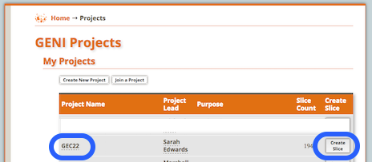 

There, please click the "Create Slice" button on the right which should take you the respective page:

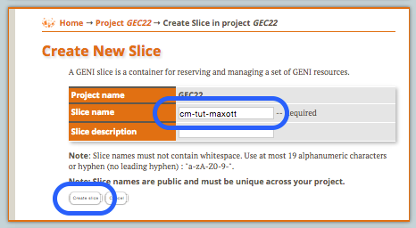 

Type in a slice name. Ideally choose a name, such as "cm-tut-xxx", where you replace 'xxx' with your GENI user name. Then press the "Create Slice" button. This should bring you to the following page:

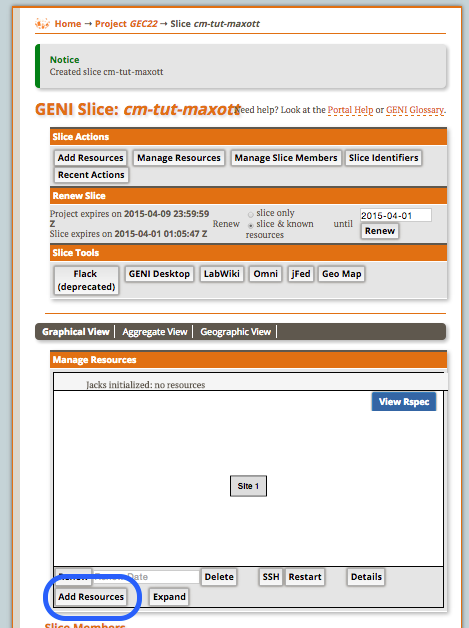 

Now press the "Add Resources" button at the bottom of the Jacks window which should get you to Jacks in interactive mode. There grab one node from the aggregate you have been assigned to and select the Ubuntu 12.04 image.

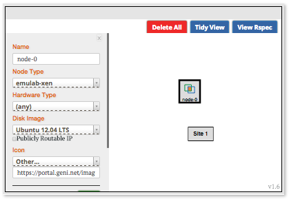

The click on the "site" icon and pick the appropriate Aggregate

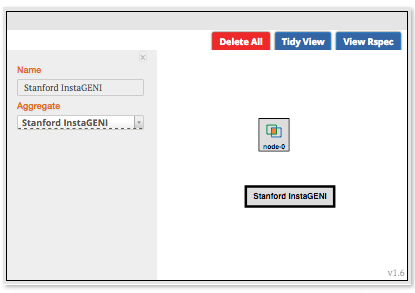

Finally press the "Reserve Resources" button at the bottom of the page.

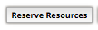

You should be redirected to a page which shows you the progress in bringing up the requested node.

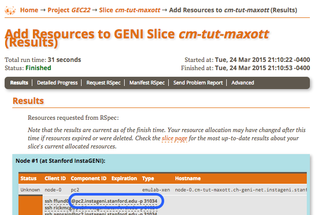

Now, we need to wait until the status at the top of the page turns to a green "Finished".

## Create A Chef Server Account

For this tutorial we create an account at the hosted Chef Server by ...

If you don't already have an account, point your browser 
[here](https://manage.chef.io/signup) and fill in the form.

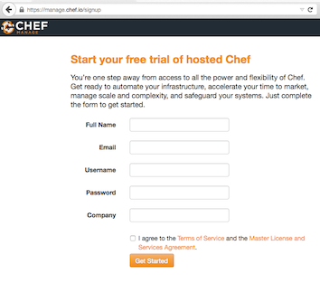

After signing up, you will be asked to create an organisation. For this tutorial, just simply choose your slice name.

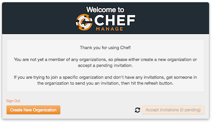

After that you should get to a welcome page

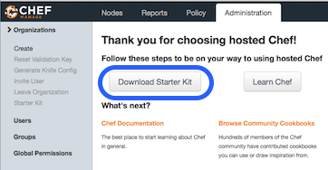

Go ahead and download the "Starter Kit", which is actually a zip file. Go to your download directory and unzip the downloaded file. It should contain the following files:

    $ tree -a chef-repo
	chef-repo
	├── .chef
	│   ├── cm-tut-maxott-validator.pem
	│   ├── demo_dude.pem
	│   └── knife.rb
	├── .gitignore
	├── README.md
	├── cookbooks
	│   ├── chefignore
	│   └── starter
	│       ├── attributes
	│       │   └── default.rb
	│       ├── files
	│       │   └── default
	│       │       └── sample.txt
	│       ├── metadata.rb
	│       ├── recipes
	│       │   └── default.rb
	│       └── templates
	│           └── default
	│               └── sample.erb
	└── roles
	    └── starter.rb

 
The only files we need are in the `.chef` directory. Let's go back to the git repo
and copy the `.chef` directory into the ???? directory
 
	$ cp -r ~/Downloads/chef-repo/.chef .
	
Now let's check if we can contact the previously created Chef Server account
	
	chef-repo$ knife node list

    chef-repo$ 

In this case, __NOT__ seeing anything is a good thing.

## Provision the Node

The resource is supposed to be up. Let's first find out the ssh details from the GENI Portal's Resource page:

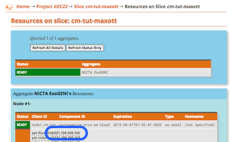

So let's try to "ssh" into it. Please copy the relevant entry in the Node listing for your account and check if you can log into the node.

    $ ssh {{your_user_name}}@{{hostname}} -p {{ssh_port}}
    ....
    xxx@node-0:~$ HOORAY!!
    
Now, lets see if we can bootstrap the node with Chef. We could try to fully configure the node in one shot, but let's take it slow.

    $ knife bootstrap {{hostname}} --ssh-user {{your_user_name}} --ssh-port {{ssh_port}} --sudo
    ...edu Installing Chef Client...
    ...edu --2015-03-24 19:51:34--  https://www.opscode.com/chef/install.sh
    ...edu Resolving www.opscode.com (www.opscode.com)... 184.106.28.90
    ...
    
If everything works out as expected, you should see your node on the Chef Server Console

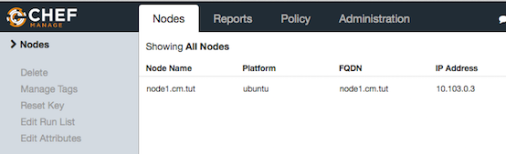

Or if we re-run our previous attempt to list all known nodes:

    $ knife node list
    node1.cm.tut

__The returned name is going to be used later, so please remember it__

Now let's create a very simple cookbook to see the basics. We first start with setting up the skeleton.

    $ mkdir cookbooks
    $ cd cookbooks
    $ chef generate cookbook hello_world
    Compiling Cookbooks...
    Recipe: code_generator::cookbook
    ...
    
This create the following files:

    $ tree
	.
	└── hello_world
	    ├── Berksfile
	    ├── README.md
	    ├── chefignore
	    ├── metadata.rb
	    ├── recipes
	    │   └── default.rb
	    ├── spec
	    │   ├── spec_helper.rb
	    │   └── unit
	    │       └── recipes
	    │           └── default_spec.rb
	    └── test
	        └── integration
	            └── default
	                └── serverspec
	                    ├── default_spec.rb
	                    └── spec_helper.rb

What really interests us is the `default.rb` file in `hello_world/recipes`. 

    $ knife cookbook upload hello_world
    
We now configure the node to use the _hello_world_ recipe:

    $ knife node run_list add {{node_name}} hello_world
    nodeG4:
    run_list: recipe[hello_world]
    ...
    
And now force the node to run it:
    
    $ knife ssh xxx.xxx.xxx.xxx 'sudo chef-client' --manual-list --ssh-user maxott --ssh-port 22 
    xxx.xxx.xxx.xxx Starting Chef Client, version 12.1.2
    xxx.xxx.xxx.xxx resolving cookbooks for run list: ["hello_world"]
    ...
    
Now let's check if it worked:

    $ knife ssh xxx.xxx.xxx.xxx 'cat /tmp/hello_world.txt' --manual-list --ssh-user maxott
    xxx.xxx.xxx.xxx Hello max from node1.cm.tut (node1.cm.tut)
    
## A More Serious Coniguration

    $ $ knife cookbook upload -a
	Uploading apt            [2.7.0]
	Uploading hello_world    [0.1.0]
	Uploading magic_shell    [1.0.0]
	Uploading omf_rc         [0.1.0]
	Uploading oml            [0.1.0]
	Uploading starter        [1.0.0]
	Uploading yum            [3.5.3]
	
Add the `oml` recipe

    $ knife node run_list add node1.cm.tut oml
	node1.cm.tut:
	  run_list:
	    recipe[hello_world]
	    recipe[oml]

And force it get configured:

    $ knife ssh xxx.xxx.xxx.xxx 'sudo chef-client' --manual-list --ssh-user maxott --ssh-port 22 
    xxx.xxx.xxx.xxx Starting Chef Client, version 12.1.2
    xxx.xxx.xxx.xxx resolving cookbooks for run list: ["hello_world"]
    ...

    $ knife node run_list add node1.cm.tut omf_rc
	node1.cm.tut:
	  run_list:
	    recipe[hello_world]
	    recipe[oml]
	    recipe[omf_rc]

$ mkdir -p cookbooks/hello_world/templates/default
Maxs-laptop:chef-repo max$ vi cookbooks/hello_world/templates/default/hello_world.txt.erb
$ knife cookbook upload hello_world
$ $ knife ssh 221.199.209.165 'sudo chef-client' --manual-list --ssh-user maxott --ssh-port 22 

knife node run_list add nodeG4 omf_rc

