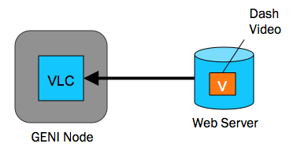
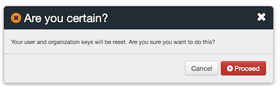
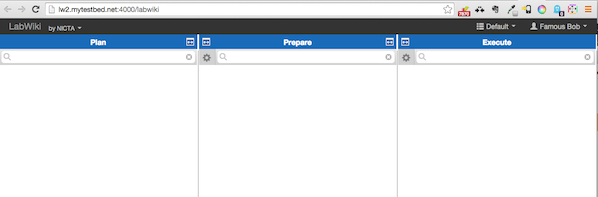
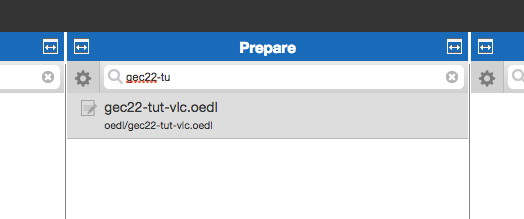
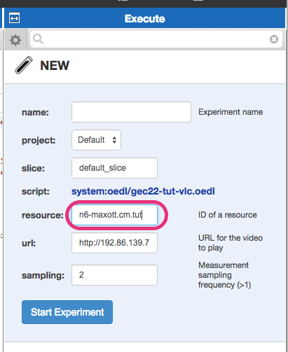
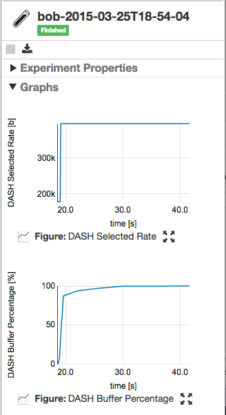

# Provisioning GENI Resources with Chef

## Objective for this Session

In this session, we want to set up a simple experiment using GENI resources. The experiment is shown below. We'll provision a slice with a single VM inside, configure that node with Chef to contain an OML instrumented VLC player and the OMF resource controller. And finally we will run a simple experiment where we play a DASH video, hosted on a shared, outside the slice, server and record and visaulize some measurements.

 

## Install Chef Development Kit

The first step to managing a node remotely is to install the Chef Development Kit (ChefDK) on your workstation. 

Please go [here](https://downloads.chef.io/chef-dk/) and download the version appropriate for your laptop.

## Provision a Resource

While Chef or any of the infrastructure tools really start shining when you have to deal with many resources, let's start small and provision a new slice with a single node in it.

So go the GENI Portal, log in, go to the "GEC22" project page - you should already be a meber if you registered for this tutorial. 

 

There, please click the "Create Slice" button on the right which should take you the respective page:

 

Type in a slice name. Ideally choose a name, such as "cm-tut-xxx", where you replace 'xxx' with your GENI user name. Then press the "Create Slice" button. This should bring you to the following page:

 

Now press the "Add Resources" button at the bottom of the Jacks window which should get you to Jacks in interactive mode. 

__Please closely follow these instructions__

* Click the __Site__ icon
* Select any __ExoGENI__ site
* Drag __ONE__ VM to the right
* Select
    * Name: __n-{{slice name}}.cm.tut__
    * Node Type: __XOSmall__
    * Disk Image: __Ubuntu 12.04__
    

<!--

The click on the "site" icon and pick the appropriate Aggregate

-->
Finally press the "Reserve Resources" button at the bottom of the page.

You should be redirected to a page which shows you the progress in bringing up the requested node.

Now, we need to wait until the status at the top of the page turns to a green "Finished".

## Download the Tutorial Repository

Go to some temporary directory on your machine and download the git repo:

    $ git clone https://github.com/maxott/gec22_chef_tutorial.git

## Create A Chef Server Account

For this tutorial we will create an account at the hosted Chef Server by Opscode.

If you don't already have an account, point your browser 
[https://manage.chef.io/signup](https://manage.chef.io/signup) and fill in the form.

After signing up, you will be asked to create an organisation. For this tutorial, just simply choose your __slice name__ as the __short name__.

After that you should get to a welcome page

Go ahead and download the "Starter Kit", which is actually a zip file. Go to your download directory and unzip the downloaded file. 

__Ignore the 'Key Reset Warning'__

It should contain the following files:

    $ tree -a chef-repo
	chef-repo
	├── .chef
	│   ├── cm-tut-maxott-validator.pem
	│   ├── demo_dude.pem
	│   └── knife.rb
	├── .gitignore
	├── README.md
	├── cookbooks
	│   ├── chefignore
	│   └── starter
	│       ├── attributes
	│       │   └── default.rb
	│       ├── files
	│       │   └── default
	│       │       └── sample.txt
	│       ├── metadata.rb
	│       ├── recipes
	│       │   └── default.rb
	│       └── templates
	│           └── default
	│               └── sample.erb
	└── roles
	    └── starter.rb

 
The only files we need are in the `.chef` directory. Let's go back to the `gec22_chef_tutorial` directory (the git repo you cloned earlier)
and copy the `.chef` directory into its `chef-repo` directory
 
	$ cp -r ~/Downloads/chef-repo/.chef chef_repo	
	
Now let's check if we can contact the previously created Chef Server account. For that we need to cd into the `chef-repo` directory.
	
	$ cd chef-repo
	$ chef-repo$ knife node list

    chef-repo$ 

In this case, __NOT__ seeing anything is a good thing.

## Provision the Node

The resource is hopefully up by now. Let's first find out the ssh details from the GENI Portal's Resource page:

So let's try to "ssh" into it. Please copy the relevant entry in the Node listing for your account and check if you can log into the node.

    $ ssh {{your_geni_name}}@{{hostname}} 
    ....
    xxx@node-0:~$ HOORAY!!
    
Now, please __LOG OUT__ of the node.

We now attempt to bootstrap the node with Chef from our laptop. We could try to fully configure the node in one shot, but we'll take it slow.

    $ knife bootstrap {{hostname}} --ssh-user {{your_geni_name}} --sudo
    ...edu Installing Chef Client...
    ...edu --2015-03-24 19:51:34--  https://www.opscode.com/chef/install.sh
    ...edu Resolving www.opscode.com (www.opscode.com)... 184.106.28.90
    ...
    
__NOTE:__ You may have to add `--identity-file ~/.ssh/my_geni_ssh_file` if you use a different key file for GENI from your default one.
    
If everything works out as expected, you should see your node on the Chef Server Console

Or if we re-run our previous attempt to list all known nodes:

    $ knife node list
    node1.cm.tut

__The returned name is going to be used later, so please remember it__

Now let's create a very simple cookbook to see the basics. We first start with setting up the skeleton.

    $ cd cookbooks
    cookbooks$ chef generate cookbook hello_world
    Compiling Cookbooks...
    Recipe: code_generator::cookbook
    ...
    
This create the following files:

    $ tree
	.
	└── hello_world
	    ├── Berksfile
	    ├── README.md
	    ├── chefignore
	    ├── metadata.rb
	    ├── recipes
	    │   └── default.rb
	    ├── spec
	    │   ├── spec_helper.rb
	    │   └── unit
	    │       └── recipes
	    │           └── default_spec.rb
	    └── test
	        └── integration
	            └── default
	                └── serverspec
	                    ├── default_spec.rb
	                    └── spec_helper.rb

What really interests us is the `default.rb` file in `hello_world/recipes`. 

Please `cd` __BACK UP__ to the `chef-repo` directory. We already provided you with a pre-edited `default.rb` file and a corresponding template file in the `hello_world_helper` directory. Have a look at them and then do the following

    $ cp hello_world_helper/default.rb cookbooks/hello_world/recipes/default.rb
    $ mkdir -p cookbooks/hello_world/templates/default
    $ cp hello_world_helper/hello_world.txt.erb cookbooks/hello_world/templates/default
    
Now we upload the newly created cookbook to the Chef Server

    $ knife cookbook upload hello_world
    
We now configure the node to use the _hello_world_ recipe:

    $ knife node run_list add {{node_name}} hello_world
    nodeG4:
    run_list: recipe[hello_world]
    ...
    
And now force the node to run it:
    
    $ knife ssh xxx.xxx.xxx.xxx 'sudo chef-client' --manual-list --ssh-user maxott --ssh-port 22 
    xxx.xxx.xxx.xxx Starting Chef Client, version 12.1.2
    xxx.xxx.xxx.xxx resolving cookbooks for run list: ["hello_world"]
    ...
    
Now let's check if it worked:

    $ knife ssh xxx.xxx.xxx.xxx 'cat /tmp/hello_world.txt' --manual-list --ssh-user maxott
    xxx.xxx.xxx.xxx Hello max from node1.cm.tut (node1.cm.tut)
    
## A More Serious Coniguration

    $ $ knife cookbook upload -a
	Uploading apt            [2.7.0]
	Uploading hello_world    [0.1.0]
	Uploading magic_shell    [1.0.0]
	Uploading omf_rc         [0.1.0]
	Uploading oml            [0.1.0]
	Uploading starter        [1.0.0]
	Uploading yum            [3.5.3]
	
Add the `oml` recipe

    $ knife node run_list add {{node_name}} oml omf_rc vlc_oml
	xxx.cm.tut:
	  run_list:
	    recipe[oml]
	    recipe[omf_rc]
	    recipe[vlc_oml]

And force it get configured:

    $ knife ssh xxx.xxx.xxx.xxx 'sudo chef-client' --manual-list --ssh-user {{your_geni_name}}
    xxx.xxx.xxx.xxx Starting Chef Client, version 12.1.2
    xxx.xxx.xxx.xxx resolving cookbooks for run list: ["hello_world"]
    ...
    
__NOTE:__ You may have to add `--identity-file ~/.ssh/my_geni_ssh_file`

We now should have `vlc` and few other tool installed. Let's check it out.

    $ ssh {{your_geni_name}}@{{hostname}} 
    $ which vlc
    /usr/bin/vlc
    
Great!

## Time to Experiment!

Go to LabWiki at [http://lw2.mytestbed.net:4000](http://lw2.mytestbed.net:4000)

Now let's look at the experiment script

Drag the top of the column to the right, empty column and you should see:

)

Please type in the name of your resource and then press the __Start Experiment__ button.

The xperiment will start a VLC client on the node and attempt to stream a DASH video from an expternal server for approx. 30 seconds. During that time we collect various metrices from the player which is being displayed in the experiment column. Your screen, at the end of the experiment should look approximately like this:

## That's it, Folks

Thank you for attending this tutorial. We just scratched the surface in what can be done. 

Please remember that while this looks like a lot of effort to just provision ONE node, most of the setup we did during this hour will drastically speed up configuring your next 10, 100, 1000 nodes. And most importantly, you now can be much more confident that all your resources are setup the same way. It may not be correct, but it is consistent.

Happy Experimenting!

If you have any questions or feedback, please contact me at [max.ott@nicta.com.au](mailto:max.ott@nicta.com.au)

